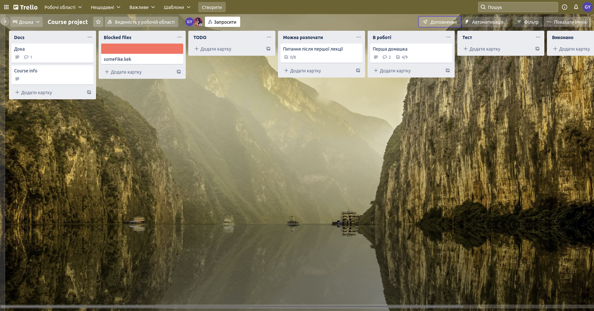

# Team and project
## Team name
> KoluchiyMandarin

## Team members list 
1. > Пальчик Максим (ІП-93) - **team leader**
1. > Горбунова Єлизавета (ІП-93)

## Unity version
> 2020.3.28f1

 

# Lab
## About team task management
Note: we decided to write names of used binary files in column "Blocked Files" to prevent merge conflicts.

## Assets 
Ми були визначилися із сетингом гри, але потрібних асетів поки не знайшли, тож лишимо для прикладу ці, але поки ще над асетами ідуть активні роздуми.
 - [cool wizard](https://assetstore.unity.com/packages/2d/characters/evil-wizard-168007)
 - [slime](https://assetstore.unity.com/packages/2d/characters/slime-character-157405)

## Plugin  
Додано плагін DOTween в проєкт.

## Chosen games analysis

### Polytopia
Це чарівна ~~майнкрафтоподібна~~ покрокова стратегія для мобільних девайсів, яка допомагає гравцям знищити сусіднє плем'я кінцево і безповоротньо. Гра не має сюжету, є сесійною - для того щоб гравець міг перериватися коли необхідно, що є дуже актуальним для мобільних гравців.  

**Мета гри**: має два режими: might, glory. В першому випадку необхідно завоювати столицю ворога, в ~~нудному~~ другому - для перемоги вимагається першому досягнути певної кількості поінтів. 1 - підійде для більш агресивних гравців (або мрійників), що бажають повністю знищити ворога, а 2 - сподобається стратегам, що більш зосереджуються на економічній складовій.  

**Ігрові класи**: Перед початком гри гравець може обрати плем'я, які відрізняються технологіями, територією та юнітами.  

**Ігрове поле**: поле нагадує шахову дошку. Мапа поділена на 4кутні блоки. На першому ході гравець з'являється в рандомному місці на карті в місті з першим рівнем, яке і стає столицею майбутньої імперії. Столиця на початку дає 2 зірочки, на відміну відж звичайних міст (1). Кожне місто, має прилеглу територію (1 квадрат навколо), яка може розширитись в майбутньому. Окрім цього, на початку нічого не видно - клітинки закриті білим снігом. Юніт просувається по карті та відкриває нові поля. Метою юніта є знайти нейтральні поселення, які можна буде захопити та перетворити на міста, які даватимуть зірочки. Територія може бути різною - гори, ліси, поля, ріки, моря, океани - кожна клітинка - окремий вид.

**Ігрова економіка**: 
під час матчу в грі наявна лише одна валюта - зірки, які можна отримати:
- на початку гри
- на початку ходу (за міста в імперії)
- за першу зустріч з ворожим плем'ям
- за виконання ігрових цілей
- за зібрані скарби

За цю універсальну валюту купуються всі технології, юніти та нові будівлі. 

Технології та юніти залежно від їх рівня можуть бути дорожчими або дешевшими (дорожчі не відкриються поки не будуть досліджені дешевші). Розвиток міст відбувається за допомогою навколишніх ресурсів, які знаходяться в межах міста. За збирання врожаю, полювання, створення доріг тощо збирається певна кількість зірочок і надається одна чи дві поділки рівня - в залежності від ресурсу. Як вже говорилося вище - рівень складається з поділок, чим більше рівень - тим більше поділок (тобто тим складніше його отримати). За кожне підвищення рівня міста надається приз - плюс зірочка на кожному ході та якась плюшка (може бути стіна навколо міста, велетень або додаткові поінти). Чим більше місто - тим більше юнітів можна в ньому зробити.  

**Юніти**: юнітів можна поділити на кілька тірів
* Т0 - дефолтний воїн доступний всім і відразу має 2 захисту та 2 атаки
* Т1 - лучники та захисники
* Т2 - мечники, катапультии, ~~ІМБОКОНЯКИ~~ вершниики
* Т3 - в суперюніт, що дається після підвищення рівня піста починаючи з 5 того рівня

Кожен юніт має базові характеристики захисту, атаки та дальності ходу а також властивості. Властивості для прикладу: літає, ходить та б'є, захисник (х2 захист в місті)

Юніти розташовані в різних гілках технологій та завичай працюють за принципом камінь, ножиці, папір ~~ІМБОКОНЯКИ~~.

Говорячи про вершників, зазвичай Т2 юніти коштують 8 зірочок, але в останньому патчі розробники також помітили певні проблеми з балансом. Тож наразі конячки коштують 10 а мечники 5. Тому що на пізніх стадіях гри, без доріг мечники дуже повільно переміщуються й не є настільки ефективними.

**Монетизація**: ігри то круто, але їсти також хочеться.
В даній грі ви не побачите таймери які можна пришвидшити чи вже всіх діставші батлпаси ~~не привиди EA~~. Купувати можна лише нові племена, в них різні технології, що дає свободу новим стратегіям та просто милують око. Є дорогі та дешеві племена. Дорогі відрізняються наявністю унікальних технологій та відходом від звичних тактик ведення бою, новими юнітами. Як на мене гра може мати турніри, але лише зі стандартним набором племен та дешевими. Дорогі ж сбалансовані не дуже добре. Хоча видно що розробники намагалися. Пей ту він це не сюди. Також сама грає не безкоштовна. Думаю купити наве полем'я - це й подяка розробникам й новий експіріенс, що підтримує інтерес до гри.

## Channels

- [Sykoo](https://www.youtube.com/channel/UCNJvwJ6daLmw4_gUKTw4cSg) 
- [Brackeys](https://www.youtube.com/c/Brackeys) 
- [Гоша Дударь](https://www.youtube.com/c/gosha_dudar)
